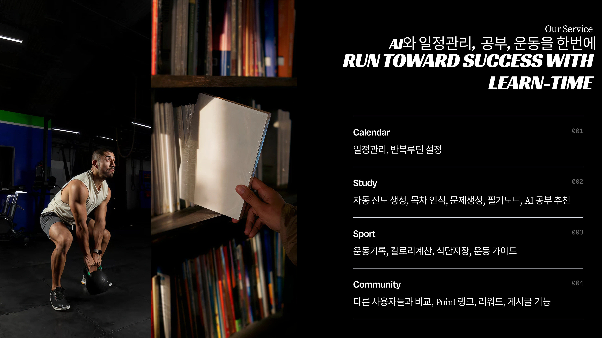
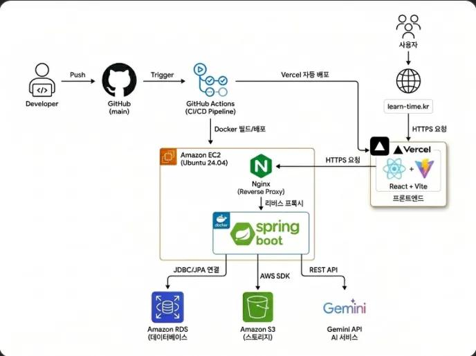
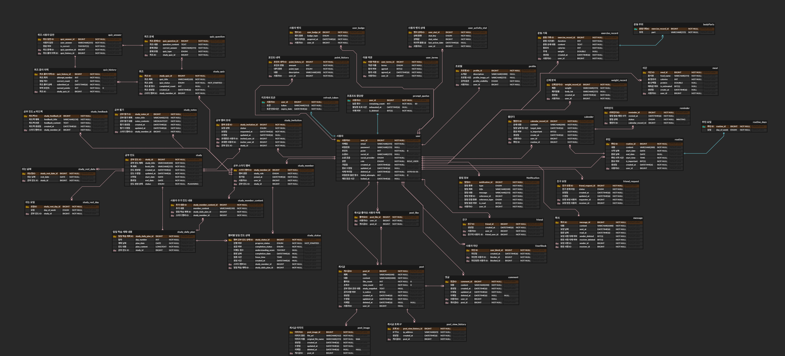

  <h2 style="margin-top: 10px; text-align: center;">AI를 활용한 종합 자기개발 & 성장 플랫폼, Learn-Time</h2>

  
  

# 1. 프로젝트 소개

<h3 style="font-size: 1.6em;">1-1. 프로젝트 개요</h3>

**LearnTime**은 AI를 활용하여 사용자의 공부, 운동과 같은 자기개발을 돕는 **종합 성장 플랫폼**입니다.

- **AI 맞춤 지원**: 공부 노트 분석, 퀴즈 생성, 운동 및 식단 피드백 등 AI 기반 맞춤형 기능을 통해 효율적인 성장을 돕습니다.
- **게이미피케이션 도입**: 단순히 기록하는 것에 그치지 않고, 포인트, 티어, 배지 시스템을 통해 지속적인 동기 부여를 제공합니다. 성장에 대한 심리적 장벽을 낮추고 재미있게 목표를 달성할 수 있도록 유도합니다.

---

<h3 style="font-size: 1.6em;">1-2. 주요 기능 및 엔드포인트</h3>

프로젝트의 핵심 도메인별 제공하는 주요 기능은 다음과 같습니다.

| 도메인 | 프런트엔드 라우트 (URL) | 주요 기능 설명 |
|---|---|---|
| **User / Auth** | `/login`, `/signup`, `/mypage`, `/profile/:userId` | JWT 기반 회원가입/로그인, 마이페이지, 프로필 정보 관리 및 게이미피케이션 수치(티어, 포인트, 배지) 조회 기능 |
| **Study** | `/study`, `/study/:studyId`, `/study/notes/...`, `/study/quiz/...`, `/study/feedback/...` | 실시간 공부 타이머 및 기록 관리, AI 학습 노트 생성, AI 퀴즈 생성 및 피드백 조회 기능 |
| **Exercise** | `/exercise` | 운동 루틴 생성 및 기록, 섭취 식단(Meal) 기록, 체중 변화 관리, AI 기반 운동 및 식단 분석 피드백 |
| **Community** | `/community`, `/community/ranking`, `/community/post/:postId`, `/community/post/create`, `/community/post/edit/:postId` | 자유로운 정보 공유를 위한 게시글 작성, 수정, 삭제 기능 및 댓글, 좋아요 상호작용 |
| **Social** | `/messages`, `/notifications`, `/friend/requests` | 다른 유저와의 친구 맺기, 원치 않는 유저 차단, 1:1 쪽지(Message) 기능, 실시간 알림(SSE) 수신 |
| **Calendar** | `/schedule` | 캘린더 기반의 월간/주간 학습 및 운동 일정 통합 관리, 개인 맞춤형 루틴 설정 및 조회 |

---

<h3 style="font-size: 1.6em;">1-3. 외부 API</h3>

- **Google Gemini API**: 사용자의 공부 노트를 기반으로 내용을 분석하고 퀴즈를 자동 생성하며, 운동 및 식단에 대한 AI 피드백 등 맞춤형 분석 정보를 제공합니다.
- **YouTube Data API v3**: 사용자의 관심사와 필요에 맞는 학습 및 운동 관련 추천 동영상을 검색하고 제공하는 데 활용됩니다.
- **식품의약품안전처 식품영양성분 데이터베이스 API**: 사용자가 식단(Meal) 기록 시 섭취한 음식의 칼로리 및 세부 영양소 데이터를 정확하게 조회하기 위해 사용됩니다.
---

 

# 2. 기술 스택 및 아키텍처

<h3 style="font-size: 1.6em;">2-1. 기술 스택</h3>

### Backend
 

### Frontend
  

### Database
 

### Infra & DevOps
     

---

<h3 style="font-size: 1.6em;">2-2. 시스템 아키텍처</h3>

---

<h3 style="font-size: 1.6em;">2-3. ERD</h3>

[ERD Cloud](https://www.erdcloud.com/d/mWyQh3cSBiSeABfgz)

---

 

# 3. 결과물 및 팀원 정보

<h3 style="font-size: 1.6em;">3-1. 시연 영상</h3>

---

<h3 style="font-size: 1.6em;">3-2. 발표 자료</h3>

[ 발표 자료 보기](./docs/learn-time%20팀%20프로토타입%20발표%20자료.pdf)

---

<h3 style="font-size: 1.6em;">3-3. 팀원 소개 및 GitHub</h3>

<table width="100%">
  <tr>
    <td width="33%" align="center">
      <a href="https://github.com/heesik03">
         
        <strong>김희식</strong>
      </a>
    </td>
    <td width="33%" align="center">
      <a href="https://github.com/zlkdjkdj">
         
        <strong>길재현</strong>
      </a>
    </td>
    <td width="33%" align="center">
      <a href="https://github.com/Jinpiter">
         
        <strong>정진우</strong>
      </a>
    </td>
  </tr>
  <tr>
    <td align="center">팀장</td>
    <td align="center">팀원</td>
    <td align="center">팀원</td>
  </tr>
  <tr>
    <td align="center">PM &amp; Full Stack</td>
    <td align="center">Frontend</td>
    <td align="center">Backend</td>
  </tr>
</table>
